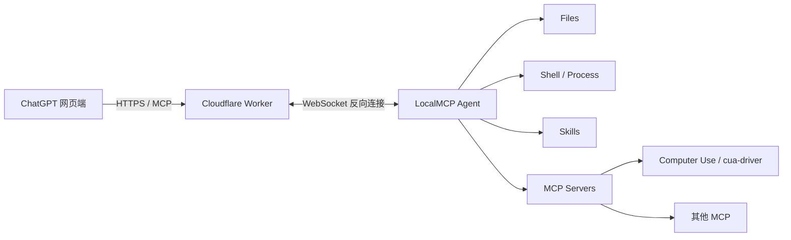

# LocalMCP

在 ChatGPT 网页版中安全地使用本机开发能力：文件操作、Shell、持久进程、Skills，以及任意可插拔 MCP Server。

> **项目初衷**：LocalMCP 最初是为了在 ChatGPT 网页端直接进行本地开发，让开发过程可以利用 ChatGPT 网页端会话额度，而不必把主要工作流切换到单独按 API Token 计费的 Agent 客户端。它通过一个反向连接的 Worker 中继，把 ChatGPT 中的 MCP 调用送到你的电脑。

## 工作原理



更完整的数据路径：

```text
┌──────────────────┐
│ ChatGPT 网页端   │
└────────┬─────────┘
         │ HTTPS / MCP
         ▼
┌──────────────────────────┐
│ Cloudflare Worker        │
│ + Durable Object         │
│                          │
│ 只负责认证与请求中继     │
└───────────┬──────────────┘
            │ WSS
            │ 本机主动建立连接
            ▼
┌──────────────────────────┐
│ LocalMCP Agent           │
├──────────────────────────┤
│ Workspace / Files        │
│ Shell / Process          │
│ Skills                   │
│ MCP Loader               │
└───────────┬──────────────┘
            │
            ├── computer → cua-driver
            ├── browser  → browser MCP
            └── ...任意标准 MCP Server
```

本机主动连接 Worker，因此不需要公网 IP、不需要开放入站端口，也不需要把本机 HTTP 服务直接暴露到公网。Worker 不执行本地开发操作，只负责把 MCP 请求转发给当前连接的 LocalMCP Agent。

## 安装

npm 包：`@daodao97/localmcp`

```sh
npm install -g @daodao97/localmcp
localmcp
```

需要 Node.js 22+。LocalMCP 按全局工具使用，不需要单独创建项目目录。首次运行 `localmcp` 时会自动创建所需的用户配置并启动 Agent。

LocalMCP 的用户级配置统一位于 `~/.localmcp/`：

```text
~/.localmcp/
├── localmcp.json
└── skills/
```

之后可以在任意目录直接运行 `localmcp`；它等价于 `localmcp start`。工作区统一在 `~/.localmcp/localmcp.json` 中配置。无需为 LocalMCP 单独创建项目目录。

常用命令：

```sh
localmcp          # 默认启动；首次运行自动创建配置
localmcp start    # 显式启动（与 localmcp 等价）
localmcp reload   # 重新加载配置并重启本地 MCP 服务
localmcp stdio    # 标准 MCP stdio 模式
localmcp http     # 本地 HTTP 模式
```

## Worker 使用方式

LocalMCP 的设计支持两种 Worker 使用方式：

1. 使用项目提供的 Worker 服务。
2. 自己部署 Worker，所有中继和密钥由自己管理。

### 方式一：使用项目提供的 Worker

这是项目希望提供给普通用户的最简单使用方式：安装 LocalMCP 后直接连接项目提供的 Worker，不需要理解 Cloudflare Worker、Durable Object 或 Wrangler。

```sh
npm install -g @daodao97/localmcp
localmcp
```

首次运行时，LocalMCP 会自动向项目 Worker 注册一个独立设备，生成该设备专属的 `agentToken`、`mcpToken` 和 `deviceId`，并保存到 `~/.localmcp/worker.json`。每个设备会被路由到独立 Durable Object，不与其他用户共享 Agent 连接或 MCP 凭证。

默认公共 Worker：`https://localmcp-relay.daodao973597.workers.dev`。如果你删除 `~/.localmcp/worker.json`，下次启动会重新注册一个新设备。完整 MCP URL 仍是访问凭证，请勿公开分享。

### 方式二：部署自己的 Worker

如果你希望完全控制中继、域名和访问密钥，可以把 Worker 部署到自己的 Cloudflare 账号。

需要：

- Cloudflare 账号
- Workers
- SQLite Durable Objects
- Wrangler

推荐直接从 GitHub 源码部署：

```sh
git clone git@github.com:daodao97/locamcp.git
cd locamcp
npm ci

npx wrangler login
npm run worker:setup
npm run worker:deploy
```

首次 `worker:setup` 会生成到用户级目录：

```text
~/.localmcp/worker.json
~/.localmcp/worker-secrets.json
```

其中 `worker.json` 保存本机使用的原始凭证；`worker-secrets.json` 只包含需要上传到 Worker 的 SHA-256 摘要。

部署后，复制 Wrangler 输出的实际 Worker 地址，例如：

```text
https://localmcp-relay.YOUR-SUBDOMAIN.workers.dev
```

重新写入实际 Worker 地址并上传密钥摘要：

```sh
node scripts/worker-setup.mjs https://localmcp-relay.YOUR-SUBDOMAIN.workers.dev
npm run worker:secrets
```

然后启动：

```sh
localmcp start
```

如果是在源码仓库中运行，也可以：

```sh
npm start
```

启动成功后 LocalMCP 会输出类似：

```text
Worker connected.
ChatGPT 服务器 URL: https://...workers.dev/mcp/<密钥>
身份验证: 无 (None)
```

把这个完整服务器 URL 添加到 ChatGPT 的 MCP/插件连接中即可。

完整 URL 本身包含访问凭证，请勿公开、提交到 Git 或发给其他人。`.localmcp/` 已加入项目 `.gitignore`。

## ChatGPT 中配置

在 ChatGPT 中创建 MCP/插件连接：

```text
名称：localmcp
描述：在我的本地工作区读取和修改文件、执行开发命令，并使用已启用的本地 MCP 能力。
服务器 URL：https://你的-worker/mcp/<密钥>
身份验证：None
```

保持：

```sh
localmcp start
```

在本机运行。ChatGPT 的调用路径就是：

```text
ChatGPT → Worker → LocalMCP → 本机工具
```

## 配置

LocalMCP 默认读取用户级配置 `~/.localmcp/localmcp.json`；也可以通过 `LOCALMCP_CONFIG` 指定其他配置文件：

```json
{
  "workspaces": {
    "project": "."
  },
  "defaultWorkspace": "project",
  "features": {
    "files": true,
    "shell": true,
    "processes": true
  },
  "skills": {
    "dir": "skills",
    "enabled": ["local-development"]
  },
  "mcpServers": {}
}
```

配置启动时使用 Zod 严格校验。仓库同时提供 `localmcp.example.json`。

### 多工作区

```json
{
  "workspaces": {
    "frontend": "/Users/me/code/frontend",
    "backend": "/Users/me/code/backend",
    "localmcp": "/Users/me/code/localmcp"
  },
  "defaultWorkspace": "frontend"
}
```

文件、Shell 和启动进程工具都接受可选的 `workspace` 参数；不传时使用 `defaultWorkspace`。

使用 `list_workspaces` 可以查看当前工作区。旧的单 `root` 配置仍兼容。

## Skills

Skill 是给模型读取的操作说明，而不是工具实现本身。

```text
skills/
├── local-development/
│   └── SKILL.md
└── computer-use/
    └── SKILL.md
```

例如 `local-development` 会指导 Agent：

- 文件读取优先使用 `read_file` / `read_file_lines`
- 修改优先使用 `edit_file` / `apply_patch` / `write_file`
- 搜索优先使用 `search_files` / `find_files`
- Shell 主要用于 build、test、Git、package manager 和开发服务器

启用 Skill：

```json
{
  "skills": {
    "dir": "skills",
    "enabled": ["local-development"]
  }
}
```

## MCP 扩展

LocalMCP Core 不需要自己实现 Computer Use、浏览器、数据库等高级能力。标准 MCP Server 可以直接作为插件挂载。

例如 Computer Use：

```json
{
  "skills": {
    "dir": "skills",
    "enabled": ["local-development", "computer-use"]
  },
  "mcpServers": {
    "computer": {
      "enabled": true,
      "command": "cua-driver",
      "args": ["mcp"]
    }
  }
}
```

LocalMCP 会读取 MCP Server 的 tools，并添加 server namespace。例如：

```text
computer_get_window_state
computer_click
computer_type_text
```

因此整体关系是：

```text
Skill = 告诉模型怎么使用一种能力
MCP   = 真正提供工具
Core  = Workspace + Files + Shell + Process + Skill Loader + MCP Loader + Relay
```

## 内置工具

| 工具 | 功能 |
| --- | --- |
| `workspace_info` / `list_workspaces` | 当前工作区 / 工作区列表 |
| `list_directory` / `workspace_tree` | 查看目录 / 项目树 |
| `find_files` / `search_files` | 查找文件 / 搜索内容 |
| `stat_path` | 文件或目录信息 |
| `read_file` / `read_file_lines` | 读取文件 |
| `write_file` | 创建或覆盖文件 |
| `edit_file` / `apply_patch` | 精确编辑 / 多行编辑 |
| `create_directory` / `delete_path` / `move_path` | 文件管理 |
| `run_command` | 执行一次性 Shell 命令 |
| `start_process` / `read_process` / `write_process` / `stop_process` / `list_processes` | 持久开发进程 |
| `list_skills` / `read_skill` | Skill |
| `<server>_*` | 外部 MCP Server tools |

## 安全边界

文件工具会限制在配置的 Workspace 内，并拒绝目录穿越和符号链接等危险路径。

但需要注意：

- LocalMCP **不是 OS 沙箱**。
- 启用 Shell 后，命令拥有当前 OS 用户权限。
- 外部 MCP Server 也可能拥有当前用户权限。
- Worker 会转发文件内容、命令结果以及 MCP 返回的数据。
- 完整 `/mcp/<密钥>` URL 是访问凭证。
- 建议开发项目本身使用 Git，以便查看和回滚修改。

Worker 不缓存业务内容；本机离线返回 503，忙碌返回 429，超时返回 504。发生 502/504 时，本地操作可能已经执行，不应自动重复写操作。

## 其他连接方式

LocalMCP 也可以不经过 Worker：

```sh
localmcp stdio
```

或者本地 HTTP：

```sh
LOCALMCP_TOKEN=<至少32字符的密钥> localmcp http
```

Worker 模式主要解决的是：**让 ChatGPT 网页端通过固定 HTTPS MCP 地址访问主动连接出去的本机 LocalMCP。**

## 开发

```sh
git clone git@github.com:daodao97/locamcp.git
cd locamcp
npm ci
npm run check
npm test
npm run build
```

GitHub: `daodao97/locamcp`

npm: `@daodao97/localmcp`

## License

ISC
